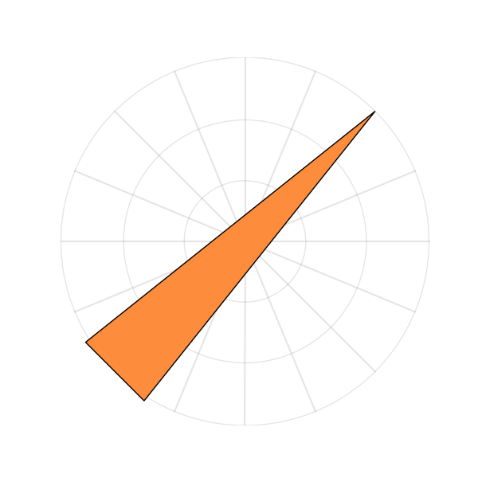
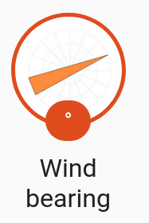

# Wind Direction Image Maker

This uses Python to generate some wind direction graphics.

I made this to make a template sensor in Home Assistant to get a wind bearing
image as a badge.

## Running

You have to install Python and Matplotlib and Numpy for this to work.

Then, run:

    python3 wind.py

And it will generate images by default in a new `pngs` subfolder. They will have names
like `45_M.png` and `67_L.png`. The images will look like this:

## Adding to Home Assistant

Once you generate your images, copy them to your Home Assistant install with something
like:

    scp pngs/*.png username@server:/path/to/homeassistant/www/wind

Then make a template sensor in your Home Assistant config::

    sensor:
      - platform: template
        sensors:
          wind_compass:
              friendly_name: "Wind bearing"
              value_template: >
                  {{ state_attr("weather.ksea_hourly", "wind_bearing") }}
              unit_of_measurement: "°"
              entity_picture_template: >
                  
                  
                  {{path-}}
                  {{((state_attr("weather.ksea_hourly", "wind_bearing") * 16 / 360)|round(0) *360/16) | int-}}_
                  L
                  M
                  H
                  
                  {{-ext-}}

This will take the actual wind bearing from the weather attribute and convert it to a path
of one of the images we generated. It uses some rounding and integer truncation to easily
map to the closest of the 16 directions we generated images for. You can adjust the if
statement bounds to get `L`, `M`, or `H` wind arrows based on the wind speed.

This then makes this kind of badge in the GUI:

## Configuring
You can adjust some constants in the Python source to change how many 
directions there are and what folder it goes to. To make fancier arrows you
will have to change the code more. Please make a PR if you do something really
fancy.

## Related work

Lots of people have done similar wind compass work for home assistant. 

* [Getting wind direction number into badge too](https://community.home-assistant.io/t/template-sensor-unit-of-measurement-dynamically/47733)
* [Yet another wind compass](https://community.home-assistant.io/t/yet-another-wind-compass-with-wind-speed-indication/144547)
* [Sensor Wind compass - up for grabs](https://community.home-assistant.io/t/sensor-wind-compass-up-for-grabs/52425)
* [Shortening the wind template](https://community.home-assistant.io/t/how-to-shorten-join-this-template/75334)
